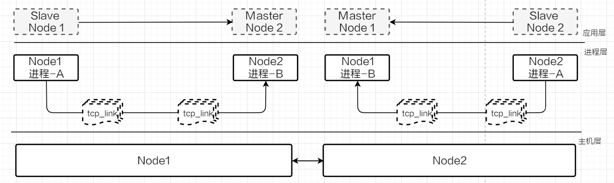
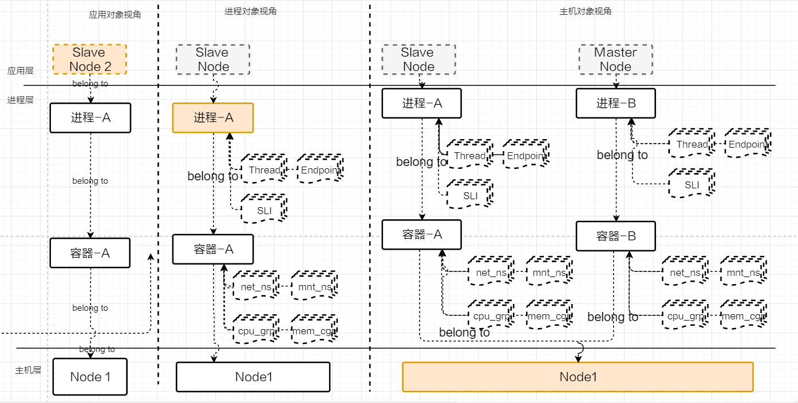
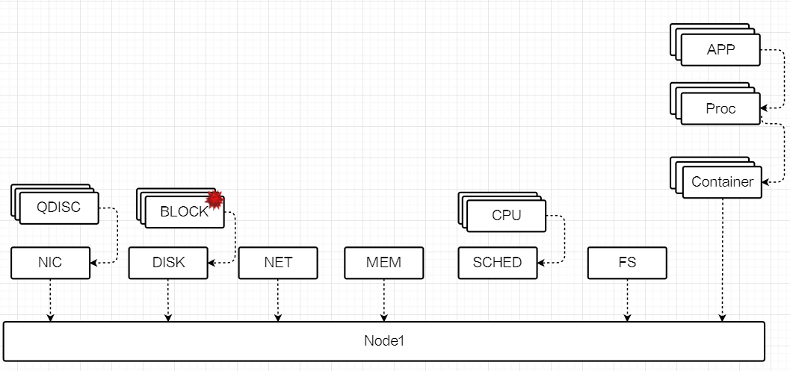

# 背景

​	云场景中基础软件/业务应用之间的边界逐渐上移，基础软件逐渐成为云场景最重要的组成部分，而操作系统又最重要的基础软件之一。
​	从业界公开的数据看，云场景的一些重要故障均是与基础软件密切相关。公开数据显示现有主流云厂商月平均故障150+次数，75%的故障<1H，90%<1.5H，少量故障>5H。

云场景的基础设施、业务场景的复杂性，导致这些故障现象大量集中基础软件（尤其是操作系统）层面。


# 介绍

​	针对云场景的故障特点，根据故障发展阶段划分成：系统隐患、灰度故障、故障 三个阶段[1]，openEuler为此针对性的推出AOps解决方案，该解决方案包括多个关键组件，本文用于介绍其中的gala-ops系列组件。

​	gala-ops系列组件定位：云基础设施场景中，针对基础设施**灰度故障**导致**的应用性能劣化、卡**顿系统级故障**在线诊断**。

[1] https://blog.acolyer.org/2017/06/15/gray-failure-the-achilles-heel-of-cloud-scale-systems/

# 原理

通过eBPF技术实现系统白盒化智能观测，实时在线完成系统架构拓扑化，在此基础完成从基础软硬件至应用现象的根因推导过程，且过程可视化。

三步骤如下：


# 为什么选择gala-ops

## 如何让用户摆脱运维工具的“七国八制”

## 如何让用户打破IT部门之间“运维部门墙”

## 如何让用户实现监控无盲区

## 如何为用户提供基础设施故障定位能力

## 如何为用户提供生产环境性能热点分析能力


# 快速安装

## 架构

gala-ops具备四个组件（gala-gopher、gala-spider、gala-anteater、gala-inference），可以选择集群部署模式、单机部署模式。

集群模式下，需要部署全部组件；单机模式可以只部署gala-gopher。

下图是推荐的集群部署模式，其中gala-gopher位于生产环境Node内，其他组件则位于云厂商管理面。


## gala-ops系统集成

集群部署模式下，gala-ops四个组件需要协同起来工作，主要依赖kafka、arangodb等软件。下图是系统集成关系图，通常将gala-gopher部署于生产环境中，其他组件（包括kafka、prometheus、arangodb等中间件）部署于管理面，用户需要确保管理面内几个组件与中间件能够互通。

gala-gopher与管理面可能无法直接互通，为此gala-gopher也提供多种<a href="https://gitee.com/MrRlu/gala-docs/blob/master/README.md" title="被集成方式">被集成方式</a>。


## gala-gopher

### 定位

- **数据采集器**：提供应用粒度low-level的数据采集，包括网络、磁盘I/O、调度、内存、安全等方面的系统指标采集，同时负责应用KPI数据的采集。
- **系统异常检测**：提供系统异常检测能力，覆盖网络、磁盘I/O、调度、内存等方面的场景系统异常，用户可以通过阈值设置异常上下限范围。
- **性能热点分析**：提供on-cpu、off-cpu火焰图。

### 原理及术语

gala-gopher软件架构参考[这里](https://gitee.com/openeuler/gala-gopher/tree/master#%E8%BF%90%E8%A1%8C%E6%9E%B6%E6%9E%84)，其是一款基于eBPF技术的低负载探针框架，除了其自身采集的数据外，用户可以自由扩展第三方探针。

**术语**

- **探针**：gala-gopher内执行具体数据采集任务的程序，包括native、extend 2类探针，前者以线程方式单独启动数据采集任务，后者以子进程方式启动数据采集任务。gala-gopher可以通过配置修改的方式启动部分或全部探针。
- **观测实体（entity_name）**：用来定义系统内的观测对象，所有探针采集的数据均会归属到具体的某个观测实体。每种观测实体均有key、label、metrics组成，比如tcp_link观测实体的key包括进程号、IP五元组、协议族等信息，metrics则包括tx、rx、rtt等运行状态指标。
- **数据表（table_name）**：观测实体由1张或更多数据表组合而成，通常1张数据表由1个采集任务完成，由此可知单个观测实体可以由多个采集任务共同完成。
- **meta文件**：通过文件定义观测实体（包括内部的数据表），系统内meta文件必须保证唯一，定义不可冲突。规范参考[这里](https://gitee.com/openeuler/gala-gopher/blob/master/doc/how_to_add_probe.md#122-%E5%AE%9A%E4%B9%89%E6%8E%A2%E9%92%88%E7%9A%84meta%E6%96%87%E4%BB%B6)。

### 支持的技术

参考这里

### 安装及使用

参考[这里](https://gitee.com/openeuler/gala-gopher#%E5%BF%AB%E9%80%9F%E5%BC%80%E5%A7%8B)

### 被集成方式

- **metrics集成方式**

  **prometheus exporter方式**：用户根据gala-gopher配置文件[手册](https://gitee.com/openeuler/gala-gopher/blob/master/doc/conf_introduction.md#metric)，设置metrics成web上报方式，以及上报[通道](https://gitee.com/openeuler/gala-gopher/blob/master/doc/conf_introduction.md#webserver%E9%85%8D%E7%BD%AE)设置，gala-gopher就会以prometheus exporter方式工作，被动响应metrics数据GET请求。

  **kafka client方式**：用户根据gala-gopher配置文件[手册](https://gitee.com/openeuler/gala-gopher/blob/master/doc/conf_introduction.md#metric)，设置metrics成kafka上报方式，以及上报[通道](https://gitee.com/openeuler/gala-gopher/blob/master/doc/conf_introduction.md#kafka%E9%85%8D%E7%BD%AE)设置，gala-gopher就会以kafka client方式工作，周期性上报metrics。用户需将metrics数据转移至prometheus内。

- **event集成方式**

  **logs方式**：用户根据gala-gopher配置文件[手册](https://gitee.com/openeuler/gala-gopher/blob/master/doc/conf_introduction.md#event)，设置event成logs上报方式，以及上报[通道](https://gitee.com/openeuler/gala-gopher/blob/master/doc/conf_introduction.md#logs%E9%85%8D%E7%BD%AE)设置，gala-gopher就会以logs方式工作，将event以日志形式写入设定目录。用户可以通过读取该目录文件，获取gala-gopher上报的event信息并上送至kafka通道内。

  **kafka client方式**：用户根据gala-gopher配置文件[手册](https://gitee.com/openeuler/gala-gopher/blob/master/doc/conf_introduction.md#event)，设置event成kafka上报方式，以及上报[通道](https://gitee.com/openeuler/gala-gopher/blob/master/doc/conf_introduction.md#kafka%E9%85%8D%E7%BD%AE)设置，gala-gopher就会以kafka client方式工作，周期性上报event。

- **meta文件集成方式**

  **logs方式**：用户根据gala-gopher配置文件[手册](https://gitee.com/openeuler/gala-gopher/blob/master/doc/conf_introduction.md#meta)，设置meta成logs上报方式，以及上报[通道](https://gitee.com/openeuler/gala-gopher/blob/master/doc/conf_introduction.md#logs%E9%85%8D%E7%BD%AE)设置，gala-gopher就会以logs方式工作，将gala-gopher集成的所有meta文件以日志形式写入设定目录。用户需要将meta信息上送至kafka通道内。

  **kafka client方式**：用户根据gala-gopher配置文件[手册](https://gitee.com/openeuler/gala-gopher/blob/master/doc/conf_introduction.md#meta)，设置event成kafka上报方式，以及上报[通道](https://gitee.com/openeuler/gala-gopher/blob/master/doc/conf_introduction.md#kafka%E9%85%8D%E7%BD%AE)设置，gala-gopher就会以kafka client方式工作，周期性上报meta信息。

### 扩展探针


## gala-spider

定位

原理及术语

支持的技术

安装及使用

扩展观测实体及关系

## gala-anteater

定位

原理及术语

安装及使用

## gala-inference

定位

原理及术语

安装及使用


# 场景介绍

## 架构感知

​	gala-ops将系统观测白盒化，通过定义系统观测实体以及实体间的关系，完成水平、垂直方向的拓扑结构。水平拓扑是基于进程之间的TCP/IP通信链路计算得出，可以实时呈现系统集群业务流状态；垂直拓扑是基于系统领域知识计算得出，可以实时呈现软件运行上下文状态。

### 观测实体

水平、垂直拓扑内展现出系统内所有观测实体，gala-ops支持的观测实体范围如下：

主机（host）

   |----------------------------------容器（container）

   |----------------------------------|---------------容器内进程（Process）

   |----------------------------------|---------------容器网络namespace （net_ns）

   |----------------------------------|---------------容器mount namespace （mnt_ns）

   |----------------------------------|---------------容器CPU CGroup （cpu_cgp）

   |----------------------------------|---------------容器内存 CGroup （mem_cgp）

   |----------------------------------进程（Process）

   |----------------------------------|---------------进程内线程（Thread）

   |----------------------------------|---------------进程内TCP链接 （tcp_link）

   |----------------------------------|---------------进程内socket（endpoint）

   |----------------------------------|---------------进程对应的高级语言运行时（runtime）

   |----------------------------------|---------------进程对应应用的性能指标（SLI）

   |----------------------------------域名访问（DNS）

   |----------------------------------|---------------客户端IP（client_ip）

   |----------------------------------|---------------DNS Sever IP（server_ip）

   |----------------------------------Nginx

   |----------------------------------|---------------客户端IP（client_ip）

   |----------------------------------|---------------虚拟IP（virtual_ip）

   |----------------------------------|---------------虚拟端口（virtual_port）

   |----------------------------------|---------------后端服务侧IP（server_ip）

   |----------------------------------|---------------后端服务侧端口（server_port）

   |----------------------------------Haproxy

   |----------------------------------|---------------客户端IP（client_ip）

   |----------------------------------|---------------虚拟IP（virtual_ip）

   |----------------------------------|---------------虚拟端口（virtual_port）

   |----------------------------------|---------------后端服务侧IP（server_ip）

   |----------------------------------|---------------后端服务侧端口（server_port）

   |----------------------------------LVS

   |----------------------------------|---------------客户端IP（client_ip）

   |----------------------------------|---------------本地IP（local_ip）

   |----------------------------------|---------------虚拟IP（virtual_ip）

   |----------------------------------|---------------虚拟端口（virtual_port）

   |----------------------------------|---------------后端服务侧IP（server_ip）

   |----------------------------------|---------------后端服务侧端口（server_port）

   |----------------------------------网卡（nic）

   |----------------------------------|---------------网卡队列（qdisc）

   |----------------------------------磁盘（disk）

   |----------------------------------|---------------磁盘逻辑卷/分区（block）

   |----------------------------------网络（net）

   |----------------------------------文件系统（fs）

   |----------------------------------cpu

   |----------------------------------内存（mem）

   |----------------------------------调度（sched）

上述部分观测实体介绍：

- **NGINX（包括LVS/HAPROXY）**：在分布式应用场景中，通常会引入LoadBalancer，以实现业务流的弹性伸缩。通过提供LoadBalancer中间件的观测信息，可以更好的展示分布式应用的实时业务流拓扑。
- **DNS**：云原生微服务场景，服务之间都以域名访问，DNS流普遍应用于各种不同云原生集群中，对其观测可以更好的展示DNS访问情况。
- **ENDPOINT**：进程内的socket信息，包括UDP（客户端/服务端），TCP listen端口，TCP客户端。
- **SLI**: 进程所属应用的SLI，常见的SLI包括应用性能时延，比如HTTP(S)访问时延、redis访问时延、PG访问时延等。SLI可以根据应用场景自由扩展。
- **RUNTIME**：高级语言（包括Java、golang、python等）存在进程级运行时，这些运行时存在GC、协程等机制影响应用性能。


架构感知就是将上述观测实体以拓扑形式呈现给用户，让用户实时了解系统当前运行状态。下面我们以openGauss主备集群来说明其应用效果。


### 水平拓扑

水平拓扑用于展示分布式应用的实时业务流，它与垂直拓扑结合在一起，可以帮助用户更好的查看分布式应用的运行状态。

水平拓扑分三层：

- 应用层：呈现应用实例之间的业务流实时拓扑（由进程级拓扑实时计算得出）
- 进程层：呈现进程实例之间的TCP流实时拓扑
- 主机层：呈现主机之间的TCP/IP实时拓扑（由进程级拓扑实时计算得出）



水平拓扑API：？

### 垂直拓扑

垂直拓扑用于展示应用实例所在资源节点的上下文依赖关系，用户可以通过扩展应用实例信息轻松获得应用实例运行上下文信息。

通过选择水平拓扑内的对象（比如上图中应用实例、进程实例或Node实例）可以从不同对象实例视角观察垂直拓扑。

下面从左至右分别给出应用实例、进程实例、Node实例视角的垂直拓扑效果。

垂直拓扑API：？


另外，为了让水平、垂直拓扑视图可以自由切换，垂直拓扑视图内可以选择任意应用实例、进程实例、Node实例跳转至水平拓扑。相应的API如下：？


## 异常检测

gala-ops具备2种异常检测能力：系统异常（也叫系统隐患）、应用异常。前者覆盖网络、磁盘I/O、调度、内存、文件系统等各类系统异常场景；后者包括常见应用时延KPI异常（包括redis、HTTP(S)、PG等），并且用户可以根据自身场景扩展KPI范围（要求KPI数据符合时序数据规范）。

异常检测结果会标识出具体的观测实体，以及异常原因。用户可以通过kafka topic获取系统实时异常信息。通过例子我们解读下异常结果信息：

```
{
  "Timestamp": 1586960586000000000,		// 异常事件时间戳
  "event_id": "1586xxx_xxxx"			// 异常事件ID
  "Attributes": {
    "entity_id": "xx",					// 发生异常的观测实体ID（集群内唯一）
    "event_id": "1586xxx_xxxx",			// 异常事件ID（同上）
    "event_type": "sys",				// 异常事件类型（sys: 系统异常，app：应用异常）
    "data": [....],     // optional
    "duration": 30,     // optional
    "occurred count": 6,// optional
  },
  "Resource": {
    "metrics": "gala_gopher_block_count_iscsi_err",	// 产生异常的metrics
  },
  "SeverityText": "WARN",				// 异常级别
  "SeverityNumber": 13,					// 异常级别编号
  "Body": "20200415T072306-0700 WARN Entity(xx)  Iscsi errors(2) occured on Block(sda1, disk sda)."								// 异常事件描述
}
```


用户通过kafka订阅到异常事件后，可以表格化管理，以时间段形式呈现管理，如下：

| 时间              | 异常事件ID   | 观测实体ID | Metrics                           | 描述                                                         |
| ----------------- | ------------ | ---------- | --------------------------------- | ------------------------------------------------------------ |
| 11:23:54 CST 2022 | 1586xxx_xxxx | xxx_xxxx   | gala_gopher_block_count_iscsi_err | 20200415T072306-0700 WARN Entity(xx)  Iscsi errors(2) occured on Block(sda1, disk sda). |

**注意**：一定时间段范围内，同一个观测实体可能会报重复上报相同异常（但事件ID不同）。所以需要基于**观测实体ID + Metrics** 去重处理。

为了更好的展示异常事件所处集群系统的位置，用户可以通过异常表格内的观测实体ID跳转至垂直拓扑视图，举例如下：



## 根因定位


## 全栈热点分析


# 常见问题


## 生产环境采集的数据无法送至管理面？

## 如何新增数据采集范围？

## 如何新增应用场景？

## 支持哪些OS？

## 支持哪些内核版本？

## 全栈热点分析调用栈为什么不能准确显示函数名？

# 常用API介绍


# 用户案例

# 合作厂商