# 背景

​	云场景中基础软件/业务应用之间的边界逐渐上移，基础软件逐渐成为云场景最重要的组成部分，而操作系统又最重要的基础软件之一。
​	从业界公开的数据看，云场景的一些重要故障均是与基础软件密切相关。公开数据显示现有主流云厂商月平均故障150+次数，75%的故障<1H，90%<1.5H，少量故障>5H。

云场景的基础设施、业务场景的复杂性，导致这些故障现象大量集中基础软件（尤其是操作系统）层面，为此openEuler社区规划&孵化A-Ops项目，该项目包括基础设施监控、应用性能监控、应用安全、自动化及监控四大块功能。

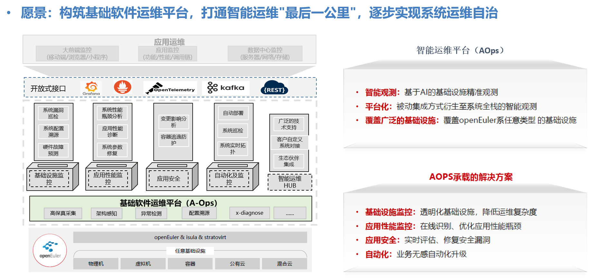

# 介绍

​	针对云场景的故障特点，根据故障发展阶段划分成：系统隐患、灰度故障、故障 三个阶段，A-Ops规划应用性能监控解决方案，该解决方案包括多个关键组件，本文用于介绍相关gala-ops系列组件。

​	gala-ops系列组件定位：云基础设施场景中，针对基础设施**灰度故障**导致**的应用性能劣化、卡**顿系统级故障**在线诊断**。提供包括**应用性能诊断、系统性能瓶颈诊断、系统参数修复、系统实时拓扑**等特性。

# 原理

通过eBPF技术实现系统白盒化智能观测，实时在线完成系统架构拓扑化，在此基础完成从基础软硬件至应用现象的根因推导过程，且过程可视化。

三步骤如下：

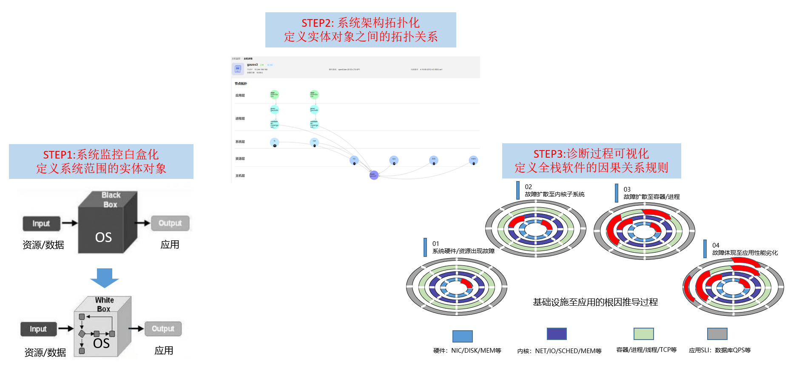


# 快速安装

## 架构

gala-ops是C/S架构，可以集群方式部署，也可以单机部署。整个架构由[gala-gopher](#gala-gopher)、gala-ops两个软件组成，在集群模式下，gala-gopher安装在生产节点内，gala-ops安装在管理面节点内；单机模式两者均安装在生产节点内。

其中，gala-ops软件内包括[gala-spider](#gala-spider)、[gala-anteater](#gala-anteater)、[gala-inference](#gala-inference)组件。

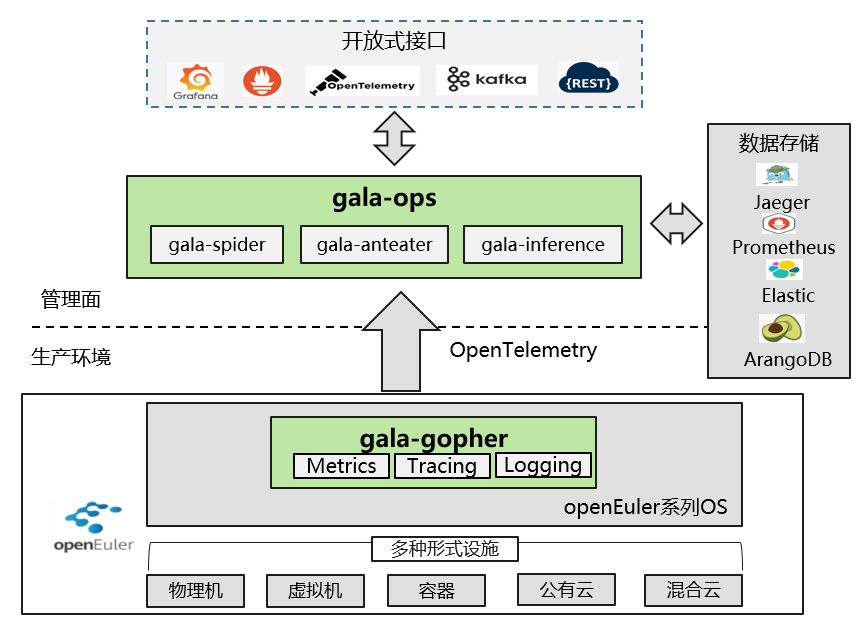

<a id="gala-gopher"></a>

## gala-gopher

### 定位

- **数据采集器**：提供应用粒度low-level的数据采集，包括网络、磁盘I/O、调度、内存、安全等方面的系统指标采集，同时负责应用KPI数据的采集。数据类型包括logging、tracing、metrics。
- **系统异常检测**：提供系统异常检测能力，覆盖网络、磁盘I/O、调度、内存等方面的场景系统异常，用户可以通过阈值设置异常上下限范围。
- **性能热点分析**：提供CPU、内存、IO火焰图。

### 原理及术语

gala-gopher软件架构参考[这里](https://gitee.com/openeuler/gala-gopher/tree/master#%E8%BF%90%E8%A1%8C%E6%9E%B6%E6%9E%84)，其是一款基于eBPF技术的低负载探针框架，除了其自身采集的数据外，用户可以自由扩展第三方探针。

**术语**

- **探针**：gala-gopher内执行具体数据采集任务的程序，包括native、extend 两类探针，前者以线程方式单独启动数据采集任务，后者以子进程方式启动数据采集任务。gala-gopher可以通过配置修改的方式启动部分或全部探针。
- **观测实体（entity_name）**：用来定义系统内的观测对象，所有探针采集的数据均会归属到具体的某个观测实体。每种观测实体均有key、label（可选）、metrics组成，比如tcp_link观测实体的key包括进程号、IP五元组、协议族等信息，metrics则包括tx、rx、rtt等运行状态指标。除原生支持的[观测实体](#观测实体)，gala-gopher也可以扩展观测实体。
- **数据表（table_name）**：观测实体由1张或更多数据表组合而成，通常1张数据表由1个采集任务完成，由此可知单个观测实体可以由多个采集任务共同完成。
- **meta文件**：通过文件定义观测实体（包括内部的数据表），系统内meta文件必须保证唯一，定义不可冲突。规范参考[这里](https://gitee.com/openeuler/gala-gopher/blob/master/doc/how_to_add_probe.md#meta%E6%96%87%E4%BB%B6%E5%AE%9A%E4%B9%89%E8%A7%84%E8%8C%83)。

### 支持的技术

采集范围：参考[这里](https://gitee.com/openeuler/gala-docs/blob/master/gopher_tech.md)。覆盖网络、I/O、内存、网卡、调度、Redis、kafka、Nginx等内核及基础软件的RED（Request、Error、Delay）数据观测。

系统异常范围：参考[这里](https://gitee.com/openeuler/gala-docs/blob/master/gopher_tech_abnormal.md)。覆盖包括TCP、Socket、进程/线程、I/O、调度等超过60个系统隐患点自动巡检及上报能力。

### 安装及使用

参考[这里](https://gitee.com/openeuler/gala-gopher#%E5%BF%AB%E9%80%9F%E5%BC%80%E5%A7%8B)

### 扩展数据采集范围

用户如果希望扩展数据采集范围，只需执行2步：定义观测实体，集成数据探针。

- **定义观测实体**

通过定义观测实体（或者更新原观测实体）用于承载新增采集metrics数据。用户通过meta文件（参考[这里](https://gitee.com/openeuler/gala-gopher/blob/master/doc/how_to_add_probe.md#2-%E5%AE%9A%E4%B9%89meta%E6%96%87%E4%BB%B6)）定义观测实体的key、label（可选）、metrics，定义完成后，将meta文件归档在[探针目录](https://gitee.com/openeuler/gala-gopher/blob/master/doc/how_to_add_probe.md#%E5%BC%80%E5%8F%91%E8%A7%86%E5%9B%BE)。

- **集成数据探针**

用户可以通过各种编程语言（shell、python、java等）包装数据采集软件，并在脚本中按照meta文件定义格式将采集到的数据通过linux管道符形式输出，参考[这里](https://gitee.com/openeuler/gala-gopher/blob/master/doc/how_to_add_probe.md#3-%E8%BE%93%E5%87%BA%E6%8E%A2%E9%92%88%E6%8C%87%E6%A0%87-1)。

参考[cAdvisor第三方探针集成案例](https://gitee.com/openeuler/gala-gopher/blob/master/doc/how_to_add_probe.md#%E5%A6%82%E4%BD%95%E6%96%B0%E5%A2%9Eextends%E6%8E%A2%E9%92%88)。

<a id="gala-spider"></a>

## gala-spider

### 定位

- **拓扑图构建**：提供 OS 级别的拓扑图构建功能，它将定期获取从 gala-gopher 采集的所有观测对象实例的数据，并计算它们之间的拓扑关系，最终将生成的拓扑图保存到图数据库 arangodb 中。

### 原理及术语

参考[这里](https://gitee.com/openeuler/gala-spider/blob/master/docs/devel/zh-CN/spider_design.md)。

### 支持的技术

**支持的拓扑关系类型**

OS 观测实体之间往往存在物理上或逻辑上的关系，比如线程和进程之间具有从属关系，进程和进程之间往往会有连接关系。因此，gala-spider 定义了一些通用的拓扑关系类型，详情参见 gala-spider 设计文档：[关系类型定义](https://gitee.com/openeuler/gala-spider/blob/master/docs/devel/zh-CN/how_to_add_new_observe_object.md#%E5%85%B3%E7%B3%BB%E7%B1%BB%E5%9E%8B%E5%AE%9A%E4%B9%89)。定义好了拓扑关系类型后，接下来就可以定义观测实体之间的拓扑关系，进而构建拓扑图。

**支持的实体关系列表**

gala-spider 默认定义了一些观测实体之间的拓扑关系，这些拓扑关系是可配置和可扩展的，详情参见 gala-spider 设计文档：[支持的拓扑关系](https://gitee.com/openeuler/gala-spider/blob/master/docs/devel/zh-CN/how_to_add_new_observe_object.md#%E6%94%AF%E6%8C%81%E7%9A%84%E6%8B%93%E6%89%91%E5%85%B3%E7%B3%BB)。

### 安装及使用

参考[这里](https://gitee.com/openeuler/gala-spider/blob/master/README.md)。

### 扩展观测实体及关系

参考[这里](https://gitee.com/openeuler/gala-spider/blob/master/docs/devel/zh-CN/how_to_add_new_observe_object.md)。

<a id="gala-anteater"></a>

## gala-anteater

### 定位
* **异常检测**：针对操作系统，提供分钟级别的异常检测能力，能够及时发现潜在影响客户端时延的系统级异常，辅助运维人员，快速跟踪并解决问题。
* **异常上报**：当发现异常行为，平台能够实时上报至Kafka，运维人员只需订阅Kafka消息队列，即可了解当前系统是否潜在风险。


### 原理及术语

gala-anteater是一款基于AI的操作系统异常检测平台。主要涵盖时序数据预处理、异常点发现、以及异常上报等功能。基于线下预训练、线上模型的增量学习与模型更新，能够很好地适应于多维多模态数据故障诊断。

* 基本原理

  通过线上线下相结合，利用**在线学习**技术，实现模型的线下学习，线上更新，并应用于线上异常检测。

  **Offline**: 首先，利用线下历史KPI数据集，经过数据预处理、特征选择，得到训练集；然后，利用得到的训练集，对无监督神经网络模型（例如Variational Autoencoder）进行训练调优。最后，利用人工标注的测试集，选择最优模型。

  **Online**: 将线下训练好的模型，部署到线上，然后利用线上真实的数据集，对模型进行在线训练以及参数调优，然后利用训练好的模型，进行线上环境的实时异常检测。

  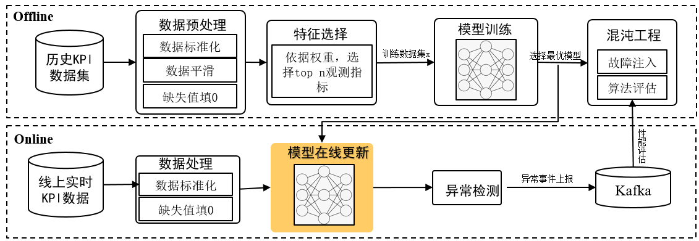

### 安装及使用
参考[这里](https://gitee.com/openeuler/gala-anteater/blob/master/README.md)

<a id="gala-inference"></a>

## gala-inference

### 定位

- **根因定位**：提供异常 KPI 的根因定位能力，它基于异常检测的结果和拓扑图作为输入，并将根因定位的结果输出到 kafka 中。

### 原理及术语

参考[这里](https://gitee.com/openeuler/gala-spider/blob/master/docs/devel/zh-CN/infer-design.md)。

### 支持的技术

**专家规则**

为了提升根因定位结果的准确性和可解释性，我们对操作系统领域内观测实体之间实际存在的一些因果关系进行了分析，并总结出一些通用的专家规则，用于指导后续的根因定位算法。这些通用专家规则的详细内容参见 gala-inference 设计文档：[专家规则](https://gitee.com/openeuler/gala-spider/blob/master/docs/devel/zh-CN/infer-design.md#%E4%B8%93%E5%AE%B6%E8%A7%84%E5%88%99)。

### 安装及使用

参考[这里](https://gitee.com/openeuler/gala-spider/blob/master/README.md)。

## gala-ops系统集成

gala-ops还依赖一些开源软件，包括kafka、arangodb、prometheus等。下图介绍gala-ops系统集成关系，kafka用于传输logs/tracing类数据至ES/logstash/jaeger，prometheus用于存储Metrics数据，Arangodb用于存储实时拓扑数据。


## gala-ops系统安装


# 项目路线图

A-Ops主要选择了8个主力场景，阶段性的落地相关解决方案。gala-ops遵从其场景规划路线图，定义自身特性落地计划，相关场景路线图及落地特性参考下图：

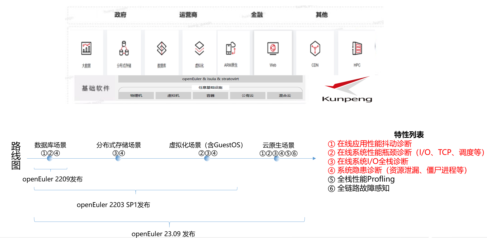


# 特性介绍

## 在线应用性能诊断

### 特性背景

在云环境中，应用性能受负载、资源等环境因素影响最大，这类因素无法在实验室中模拟，所以在线定位能力显得尤其重要，应用性能诊断存在两个难点：1）[无法识别应用性能劣化](#无法识别应用性能劣化)；2）[无法确定问题根因](#无法确定问题根因)。

- 无法识别应用性能劣化<a id="无法识别应用性能劣化"></a>

  对于CSP厂商，该问题重要性不亚于问题根因定位，因为CSP厂商对外提供的服务都有SLA的承诺，主动识别云服务SLI性能劣化，对CSP厂商而言可以提前发现问题，避免客户投诉，被动运维改为主动运维。

  我们以CSP厂商常见的DCS场景案例，介绍CSP厂商为什么难以发现云服务SLI性能劣化。

  > 分布式缓存服务（Distributed Cache Service，简称DCS）为租户提供在线分布式缓存能力，常见应用包括Redis、Memcached等，通常用于满足用户高并发及快速数据访问的业务诉求，常见使用场景包括电商、视频直播、游戏应用、社交APP等。

  当前CSP厂商常见的DCS SLI性能监控手段有2种：1）拨测方式模拟租户访问；2）DCS应用软件内性能打点；

  - [ ] 拨测方式模拟租户访问

    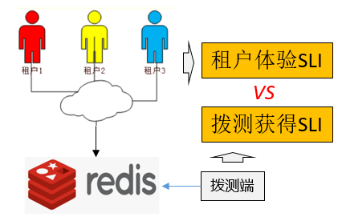

    拨测获取的DCS的SLI与真实租户访问DCS体验的SLI实际上并不相同，其中差异包括 服务访问的网络路径、访问方式、访问频率均存在差异，这种差异导致该方式存在DCS性能监控失真问题。

  - [ ] DCS应用软件内性能打点

    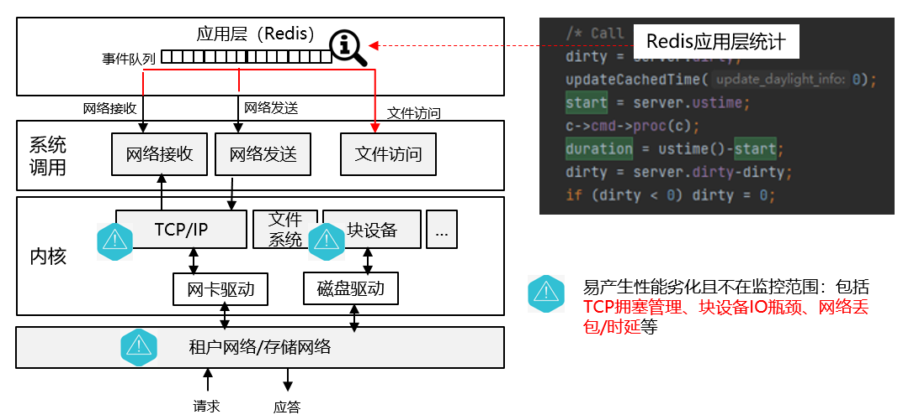

    在DCS服务应用内（比如Redis）直接性能打点获取应用性能看上去是个不错的选择，但实际情况出乎意料，经常出现租户已经投诉DCS服务SLA未达标，但是应用层监控依然不能发现问题。分析其原因，是因为应用层的性能统计，未覆盖系统层面对应用性能影响的因素，比如TCP丢包/拥塞、网络时延、块设备I/O时延、进度调度时延等。

- 无法确定问题根因<a id="无法确定问题根因"></a>

  依旧以DCS场景为例，所有CSP厂商提供的云服务都需要通过网络供租户访问，网络因素对云服务性能影响至关重要。除了网络因素，对应用影响最大包括I/O时延、调度时延、内存申请时延等。这些问题目前主要依赖OS诊断工具来实现问题的定界/定位。但是OS诊断工具存在一些问题：

  - [ ] 工具碎片化

    OS诊断工具七国八制，新工具层出不穷（BCC、Blktrace、iostat、netstat等），工具的使用依赖运维人员经验的判断在何时、何地、何种方式使用工具，运维效率取决于人员经验。

  - [ ] 线上环境使用受限

    大部分OS诊断工具都无法常驻系统，依赖故障现场抓取诊断数据，面对随机性故障时，诊断工具就无从下手；另外在面临短暂性sys CPU冲高场景时，系统会出现短暂性无法登陆、命令无法执行等情况，诊断工具也会无用武之地。除此以外，还有些工具存在需额外提权、安装受限等线上环境使用的问题。

### 解决方案

#### 高保真采集应用性能SLI

Google针对云服务SLI的评估提出VALET方法，从5个维度综合评估应用性能。我们借鉴其思路，从吞吐量（容量）、时延2个角度评估应用性能（其他维度后续也可能会纳入评估范围）。

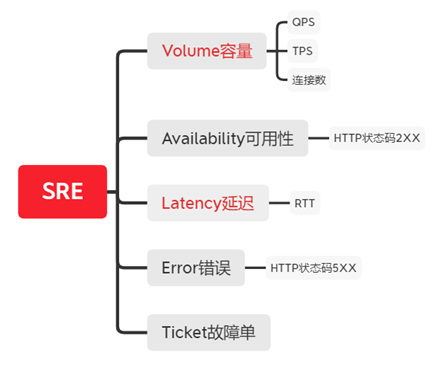

为了提升通用性（避免语言强相关性、避免应用适配SDK修改等），[gala-gopher](#gala-gopher)提供一种相对通用的应用性能SLI采集方法，我们采取从OS内核TCP视角采集应用性能数据（即理论上该方法适用所有基于TCP的应用）。

- TCP层采集应用时延性能

  时延性能采集的难点在如何降低网络重传、中断时延、调度时延等因素对时延统计带来的误差影响。参考下图，[gala-gopher](#gala-gopher)会内核软中断处会记录业务Request（访问请求[3]）到来的时间戳（TS1），并在系统调用处记录应用读取业务Request的时间戳（TS2），待云服务应用Response时会执行系统调用Write（TS3），Response会产生TCP数据流并且该TCP数据流达到Request请求端后会产生TCP_ACK（TS4）。
  通过上述四个时间戳，我们分别得到：

  应用时延性能SLI：TS4 - TS1 [1]

  应用处理时延：TS3 - TS2  [2]

  应用调度时延：TS2 - TS1   [2]

  发送方向TCP时延：TS4 - TS3  [2]

  通过该方法，我们可以实现大部分应用时延性能SLI以及处理过程中不同阶段的时延（便于问题定界）。

  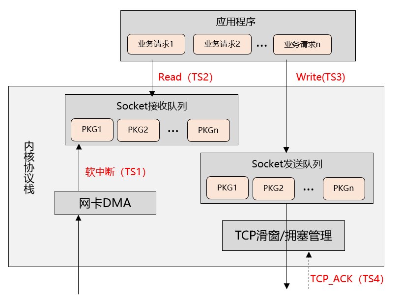

  [^1]: openEuler 22.03 SP1版本已发布。
  [^2]: openEuler 23.09版本待发布。
  [^3]: 假设云服务应用在处理访问请求时，单个TCP连接内，是按照先进先出顺序处理。如果这个假设不成立，上述时延采集可能有误差.

- TCP层采集应用吞吐量性能

  吞吐量性能采集的难点在于识别短时吞吐量下降，比如有些场景TCP传输数据过程中出现20ms周期性的滑窗不移动现象，导致平常1~3s完成的数据传输，性能劣化至10s以上才能完成。

  举个形象的例子，TCP吞吐量监控犹如高速公路监控，需要持续的监控高速路上单位时间内是否存在公路资源空闲的情况，单位时间越小监控精度越高。

  这种监控的数据观测底噪、精度带来了挑战，这部分能力规划在openEuler 23.09创新版本上线。

  备注：openEuler 22.03 SP1版本gala-gopher采集的应用吞吐量依然来自于应用自身而非OS系统层面。

#### 基础软件low-level分析

根据前面介绍[问题根因](#无法确定问题根因)的定位离不开OS系统层面的观测，鉴于现有工具的局限性，[gala-gopher](#gala-gopher)定位OS系统后台服务，提供基础软件全方位的观测能力，基于eBPF技术，持续性、低底噪的方式为采集基础软件运行时数据（主要是Metrics类型数据）。所有采集的性能Metrics数据，均会携带应用（即进程/线程）标签，实现以应用视角下钻式观测系统运行状态。

举例：

```
    {
        table_name: "tcp_abn",   --  tcp 异常统计表名
        entity_name: "tcp_link",   -- tcp 对象名
        fields:
        (
            {
                description: "id of process",
                type: "key",
                name: "tgid",   --> tcp所属进程号
            },
            {
                description: "role",
                type: "key",
                name: "role",   --> tcp类型（客户端/服务端）
            },
            {
                description: "client ip",
                type: "key",
                name: "client_ip",  --> tcp client IP
            },
            {
                description: "server ip",
                type: "key",
                name: "server_ip",  --> tcp server IP
            },
            {
                description: "client port",  --> 以下均是tcp五元组其他标签
                type: "key",
                name: "client_port",  
            },
            {
                description: "server port",
                type: "key",
                name: "server_port",
            },
            {
                description: "protocol",
                type: "key",
                name: "protocol",
            },
            {
                description: "comm",
                type: "label",
                name: "comm",    --> tcp所属进程名
            },
            {
                description: "retrans packets",
                type: "gauge",
                name: "retran_packets",  --> 以下均是tcp异常统计Metrics
            },
            {
                description: "drops caused by backlog queue full",
                type: "gauge",
                name: "backlog_drops",
            },
            {
                description: "sock drop counter",
                type: "gauge",
                name: "sk_drops",
            },
            {
                description: "tcp lost counter",
                type: "gauge",
                name: "lost_out",
            },
            {
                description: "tcp sacked out counter",
                type: "gauge",
                name: "sacked_out",
            },
            {
                description: "drops caused by socket filter",
                type: "gauge",
                name: "filter_drops",
            },
            {
                description: "counter of tcp link timeout",
                type: "gauge",
                name: "tmout_count",
            },
            .....
        )
    }
```

数据观测范围包括网络、I/O、内存、调度等，具体可以参考[这里](https://gitee.com/openeuler/gala-docs/blob/master/gopher_tech.md)。

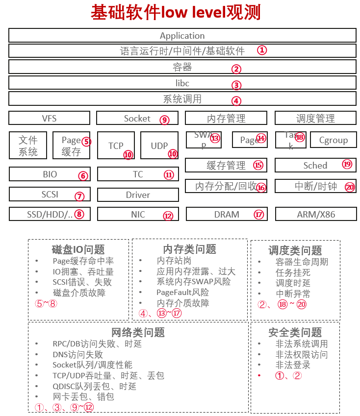

结合应用性能SLI、基础软件low-level数据观测，建立应用性能大模型，以前者为KPI，后者为特征量，通过gala-ops内相关组件完成线上问题分析，找到对应用性能劣化贡献值最大的特征量（即某个基础软件low-level Metrics）

### 案例介绍

待补充

## 系统隐患诊断

系统隐患主要指内核、基础库、运行时等中出现的一些错误、资源不足、性能突变等情况。故障原因包括网络、I/O、调度、内存等方面原因。

支持范围：参考[这里](https://gitee.com/openeuler/gala-docs/blob/master/gopher_tech_abnormal.md)

### 案例1介绍

异常检测结果会标识出具体的观测实体，以及异常原因。用户可以通过kafka topic获取系统实时异常信息。

- 样例1：主机对象内block观测实体异常：

  ```
  {
    "Timestamp": 1586960586000000000,		// 异常事件时间戳
    "event_id": "1586xxx_xxxx"			// 异常事件ID
    "Attributes": {
      "entity_id": "xx",					// 发生异常的观测实体ID（集群内唯一）
      "event_id": "1586xxx_xxxx",			// 异常事件ID（同上）
      "event_type": "sys",				// 异常事件类型（sys: 系统异常，app：应用异常）
      "data": [....],     // optional
      "duration": 30,     // optional
      "occurred count": 6,// optional
    },
    "Resource": {
      "metrics": "gala_gopher_block_count_iscsi_err",	// 产生异常的metrics
    },
    "SeverityText": "WARN",				// 异常级别
    "SeverityNumber": 13,					// 异常级别编号
    "Body": "20200415T072306-0700 WARN Entity(xx)  Iscsi errors(2) occured on Block(sda1, disk sda)."								// 异常事件描述
  }
  ```

  用户通过kafka订阅到异常事件后，可以表格化管理，以时间段形式呈现管理，如下：

  | 时间              | 异常事件ID   | 观测实体ID | Metrics                           | 描述                                                         |
  | ----------------- | ------------ | ---------- | --------------------------------- | ------------------------------------------------------------ |
  | 11:23:54 CST 2022 | 1586xxx_xxxx | xxx_xxxx   | gala_gopher_block_count_iscsi_err | 20200415T072306-0700 WARN Entity(xx)  Iscsi errors(2) occured on Block(sda1, disk sda). |

**注意**：一定时间段范围内，同一个观测实体可能会报重复上报相同异常（但事件ID不同）。所以需要基于**观测实体ID + Metrics** 去重处理。

为了更好的展示异常事件所处集群系统的位置，用户可以通过异常表格内的观测实体ID跳转至垂直拓扑视图，举例如下：

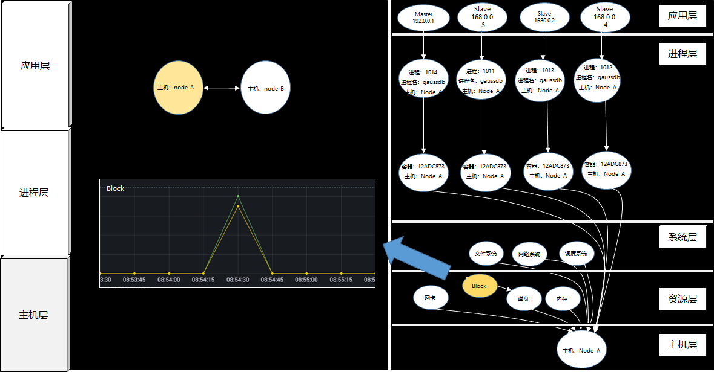

**注意**：

- 如果观测实体属于主机层，垂直视图则应跳转至主机实例垂直视图，并且该观测实体应与周边实体颜色区分。
- 用户选中存在异常的观测实体后，应跳出具体异常的metrics视图，并定位至出现异常数据的时间区间。
- 水平视图应随即进入该主机为中心的水平拓扑视图。


### 案例2介绍

样例2：进程对象内tcp_link观测实体异常：

```
{
  "Timestamp": 1586960586000000000,		// 异常事件时间戳
  "event_id": "1586xxx_xxxx"			// 异常事件ID
  "Attributes": {
    "entity_id": "xx",					// 发生异常的观测实体ID（集群内唯一）
    "event_id": "1586xxx_xxxx",			// 异常事件ID（同上）
    "event_type": "sys",				// 异常事件类型（sys: 系统异常，app：应用异常）
    "data": [....],     // optional
    "duration": 30,     // optional
    "occurred count": 6,// optional
  },
  "Resource": {
    "metrics": "gala_gopher_tcp_link_backlog_drops",	// 产生异常的metrics
  },
  "SeverityText": "WARN",				// 异常级别
  "SeverityNumber": 13,					// 异常级别编号
  "Body": "20200415T072306-0700 WARN Entity(xx) TCP backlog queue drops(13)."	// 异常事件描述
}
```


用户通过kafka订阅到异常事件后，可以表格化管理，以时间段形式呈现管理，如下：

| 时间              | 异常事件ID   | 观测实体ID | Metrics                            | 描述                                                         |
| ----------------- | ------------ | ---------- | ---------------------------------- | ------------------------------------------------------------ |
| 11:23:54 CST 2022 | 1586xxx_xxxx | xxx_xxxx   | gala_gopher_tcp_link_backlog_drops | 20200415T072306-0700 WARN Entity(xx) TCP backlog queue drops(13). |

**注意**：一定时间段范围内，同一个观测实体可能会报重复上报相同异常（但事件ID不同）。所以需要基于**观测实体ID + Metrics** 去重处理。

为了更好的展示异常事件所处集群系统的位置，用户可以通过异常表格内的观测实体ID跳转至垂直拓扑视图，举例如下：

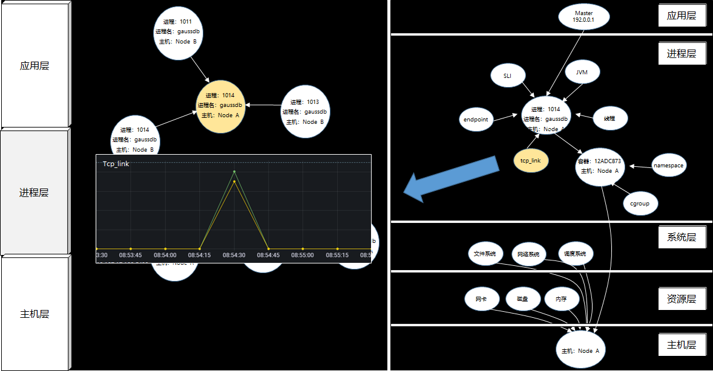

**注意**：

- 如果观测实体属于进程层，垂直视图则应跳转至具体进程实例的垂直视图，并且该观测实体应与周边实体颜色区分。
- 用户选中存在异常的观测实体后，应跳出具体异常的metrics视图，并定位至出现异常数据的时间区间。
- 水平视图应随即进入该进程为中心的水平拓扑视图。

## 系统性能瓶颈诊断

### CPU冲高诊断

### 内存泄漏（不停增长）诊断

### IO瓶颈诊断

### TCP传输性能劣化诊断


# 常见问题

1. 生产环境采集的数据无法送至管理面？
2. 如何新增数据采集范围？
3. 如何新增应用场景？
4. 支持哪些OS
5. 支持哪些内核版本
6. 支持的软件版本范围
7. 全栈热点分析调用栈为什么不能准确显示函数名？

# 常用API介绍

1. gala-anteater/gala-inference [rest接口使用说明](./gala_event_api.md)。


# 用户案例

# 合作厂商