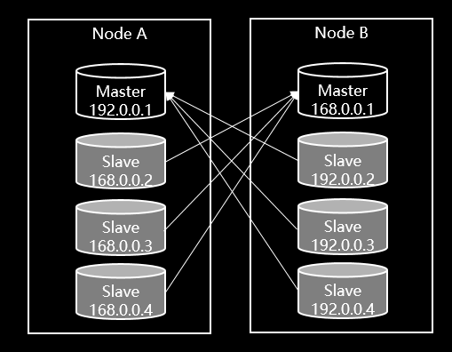
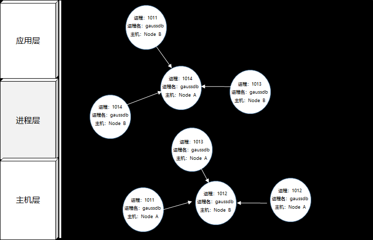

# 背景

​	云场景中基础软件/业务应用之间的边界逐渐上移，基础软件逐渐成为云场景最重要的组成部分，而操作系统又最重要的基础软件之一。
​	从业界公开的数据看，云场景的一些重要故障均是与基础软件密切相关。公开数据显示现有主流云厂商月平均故障150+次数，75%的故障<1H，90%<1.5H，少量故障>5H。

云场景的基础设施、业务场景的复杂性，导致这些故障现象大量集中基础软件（尤其是操作系统）层面。


# 介绍

​	针对云场景的故障特点，根据故障发展阶段划分成：系统隐患、灰度故障、故障 三个阶段[1]，openEuler为此针对性的推出AOps解决方案，该解决方案包括多个关键组件，本文用于介绍其中的gala-ops系列组件。

​	gala-ops系列组件定位：云基础设施场景中，针对基础设施**灰度故障**导致**的应用性能劣化、卡**顿系统级故障**在线诊断**。

[1] https://blog.acolyer.org/2017/06/15/gray-failure-the-achilles-heel-of-cloud-scale-systems/

# 原理

通过eBPF技术实现系统白盒化智能观测，实时在线完成系统架构拓扑化，在此基础完成从基础软硬件至应用现象的根因推导过程，且过程可视化。

三步骤如下：


# 为什么选择gala-ops

1. 如何让用户摆脱运维工具的“七国八制”
2. 如何让用户打破IT部门之间“运维部门墙”
3. 如何让用户实现监控无盲区
4. 如何为用户具备基础设施故障定位能力
5. 如何为用户具备生产环境性能热点分析能力


# 快速安装

## 架构

gala-ops具备四个组件（gala-gopher、gala-spider、gala-anteater、gala-inference），可以选择集群部署模式、单机部署模式。

集群模式下，需要部署全部组件；单机模式可以只部署gala-gopher。

下图是推荐的集群部署模式，其中gala-gopher位于生产环境Node内，其他组件则位于云厂商管理面。


## gala-ops系统集成

集群部署模式下，gala-ops四个组件需要协同起来工作，主要依赖kafka、arangodb等软件。下图是系统集成关系图，通常将gala-gopher部署于生产环境中，其他组件（包括kafka、prometheus、arangodb等中间件）部署于管理面，用户需要确保管理面内几个组件与中间件能够互通。

gala-gopher与管理面可能无法直接互通，为此gala-gopher也提供多种被集成方式。


## gala-gopher

### 定位

- **数据采集器**：提供应用粒度low-level的数据采集，包括网络、磁盘I/O、调度、内存、安全等方面的系统指标采集，同时负责应用KPI数据的采集。
- **系统异常检测**：提供系统异常检测能力，覆盖网络、磁盘I/O、调度、内存等方面的场景系统异常，用户可以通过阈值设置异常上下限范围。
- **性能热点分析**：提供on-cpu、off-cpu火焰图。

### 原理及术语

gala-gopher软件架构参考[这里](https://gitee.com/openeuler/gala-gopher/tree/master#%E8%BF%90%E8%A1%8C%E6%9E%B6%E6%9E%84)，其是一款基于eBPF技术的低负载探针框架，除了其自身采集的数据外，用户可以自由扩展第三方探针。

**术语**

- **探针**：gala-gopher内执行具体数据采集任务的程序，包括native、extend 2类探针，前者以线程方式单独启动数据采集任务，后者以子进程方式启动数据采集任务。gala-gopher可以通过配置修改的方式启动部分或全部探针。
- **观测实体（entity_name）**：用来定义系统内的观测对象，所有探针采集的数据均会归属到具体的某个观测实体。每种观测实体均有key、label（可选）、metrics组成，比如tcp_link观测实体的key包括进程号、IP五元组、协议族等信息，metrics则包括tx、rx、rtt等运行状态指标。除原生支持的[观测实体](#观测实体)，gala-gopher也可以扩展观测实体。
- **数据表（table_name）**：观测实体由1张或更多数据表组合而成，通常1张数据表由1个采集任务完成，由此可知单个观测实体可以由多个采集任务共同完成。
- **meta文件**：通过文件定义观测实体（包括内部的数据表），系统内meta文件必须保证唯一，定义不可冲突。规范参考[这里](https://gitee.com/openeuler/gala-gopher/blob/master/doc/how_to_add_probe.md#meta%E6%96%87%E4%BB%B6%E5%AE%9A%E4%B9%89%E8%A7%84%E8%8C%83)。

### 支持的技术

采集范围：参考[这里](https://gitee.com/openeuler/gala-docs/blob/master/gopher_tech.md)。

系统异常范围：参考[这里](https://gitee.com/openeuler/gala-docs/blob/master/gopher_tech_abnormal.md)。

### 安装及使用

参考[这里](https://gitee.com/openeuler/gala-gopher#%E5%BF%AB%E9%80%9F%E5%BC%80%E5%A7%8B)

### 被集成方式

- **metrics集成方式**

  **prometheus exporter方式**：用户根据gala-gopher配置文件[手册](https://gitee.com/openeuler/gala-gopher/blob/master/doc/conf_introduction.md#%E9%85%8D%E7%BD%AE%E4%BB%8B%E7%BB%8D)，设置metric成web上报方式，并修改配置文件中<u>web_server</u>部分，gala-gopher就会以prometheus exporter方式工作，被动响应metrics数据GET请求。

  **kafka client方式**：用户根据gala-gopher配置文件[手册](https://gitee.com/openeuler/gala-gopher/blob/master/doc/conf_introduction.md#%E9%85%8D%E7%BD%AE%E4%BB%8B%E7%BB%8D)，设置metrics成kafka上报方式，并配置<u>kafka_topic</u> ，gala-gopher就会以kafka client方式工作，周期性上报metrics。用户需将metrics数据转移至prometheus内。

- **event集成方式**

  **logs方式**：用户根据gala-gopher配置文件[手册](https://gitee.com/openeuler/gala-gopher/blob/master/doc/conf_introduction.md#%E9%85%8D%E7%BD%AE%E4%BB%8B%E7%BB%8D)，设置event成logs上报方式，并通过<u>logs</u>部分配置日志路径，gala-gopher就会以logs方式工作，将event以日志形式写入设定目录。用户可以通过读取该目录文件，获取gala-gopher上报的event信息并上送至kafka通道内。

  **kafka client方式**：用户根据gala-gopher配置文件[手册](https://gitee.com/openeuler/gala-gopher/blob/master/doc/conf_introduction.md#%E9%85%8D%E7%BD%AE%E4%BB%8B%E7%BB%8D)，设置event成kafka上报方式，并配置<u>kafka_topic</u>，gala-gopher就会以kafka client方式工作，周期性上报event。

- **meta文件集成方式**

  **logs方式**：用户根据gala-gopher配置文件[手册](https://gitee.com/openeuler/gala-gopher/blob/master/doc/conf_introduction.md#%E9%85%8D%E7%BD%AE%E4%BB%8B%E7%BB%8D)，设置meta成logs上报方式，并通过<u>logs</u>部分配置日志路径，gala-gopher就会以logs方式工作，将gala-gopher集成的所有meta文件以日志形式写入设定目录。用户需要将meta信息上送至kafka通道内。

  **kafka client方式**：用户根据gala-gopher配置文件[手册](https://gitee.com/openeuler/gala-gopher/blob/master/doc/conf_introduction.md#%E9%85%8D%E7%BD%AE%E4%BB%8B%E7%BB%8D)，设置event成kafka上报方式，并配置<u>kafka_topic</u>，gala-gopher就会以kafka client方式工作，周期性上报meta信息。

### 扩展数据采集范围

用户如果希望扩展数据采集范围，只需执行2步：定义观测实体，集成数据探针。

- **定义观测实体**

通过定义观测实体（或者更新原观测实体）用于承载新增采集metrics数据。用户通过meta文件（参考[这里](https://gitee.com/openeuler/gala-gopher/blob/master/doc/how_to_add_probe.md#2-%E5%AE%9A%E4%B9%89meta%E6%96%87%E4%BB%B6)）定义观测实体的key、label（可选）、metrics，定义完成后，将meta文件归档在[探针目录](https://gitee.com/openeuler/gala-gopher/blob/master/doc/how_to_add_probe.md#%E5%BC%80%E5%8F%91%E8%A7%86%E5%9B%BE)。

- **集成数据探针**

用户可以通过各种编程语言（shell、python、java等）包装数据采集软件，并在脚本中按照meta文件定义格式将采集到的数据通过linux管道符形式输出，参考[这里](https://gitee.com/openeuler/gala-gopher/blob/master/doc/how_to_add_probe.md#3-%E8%BE%93%E5%87%BA%E6%8E%A2%E9%92%88%E6%8C%87%E6%A0%87-1)。

参考[cAdvisor第三方探针集成案例](https://gitee.com/openeuler/gala-gopher/blob/master/doc/how_to_add_probe.md#%E5%A6%82%E4%BD%95%E6%96%B0%E5%A2%9Eextends%E6%8E%A2%E9%92%88)。

## gala-spider

### 定位

- **拓扑图构建**：提供 OS 级别的拓扑图构建功能，它将定期获取从 gala-gopher 采集的所有观测对象实例的数据，并计算它们之间的拓扑关系，最终将生成的拓扑图保存到图数据库 arangodb 中。

### 原理及术语

参考[这里](https://gitee.com/openeuler/gala-spider/blob/master/docs/devel/zh-CN/spider_design.md)。

### 支持的技术

**支持的拓扑关系类型**

OS 观测实体之间往往存在物理上或逻辑上的关系，比如线程和进程之间具有从属关系，进程和进程之间往往会有连接关系。因此，gala-spider 定义了一些通用的拓扑关系类型，详情参见 gala-spider 设计文档：[关系类型定义](https://gitee.com/openeuler/gala-spider/blob/master/docs/devel/zh-CN/how_to_add_new_observe_object.md#%E5%85%B3%E7%B3%BB%E7%B1%BB%E5%9E%8B%E5%AE%9A%E4%B9%89)。定义好了拓扑关系类型后，接下来就可以定义观测实体之间的拓扑关系，进而构建拓扑图。

**支持的实体关系列表**

gala-spider 默认定义了一些观测实体之间的拓扑关系，这些拓扑关系是可配置和可扩展的，详情参见 gala-spider 设计文档：[支持的拓扑关系](https://gitee.com/openeuler/gala-spider/blob/master/docs/devel/zh-CN/how_to_add_new_observe_object.md#%E6%94%AF%E6%8C%81%E7%9A%84%E6%8B%93%E6%89%91%E5%85%B3%E7%B3%BB)。

### 安装及使用

参考[这里](https://gitee.com/openeuler/gala-spider/blob/master/README.md)。

### 扩展观测实体及关系

参考[这里](https://gitee.com/openeuler/gala-spider/blob/master/docs/devel/zh-CN/how_to_add_new_observe_object.md)。

## gala-anteater

### 定位
* **异常检测**：针对操作系统，提供分钟级别的异常检测能力，能够及时发现潜在影响客户端时延的系统级异常，辅助运维人员，快速跟踪并解决问题。
* **异常上报**：当发现异常行为，平台能够实时上报至Kafka，运维人员只需订阅Kafka消息队列，即可了解当前系统是否潜在风险。


### 原理及术语

gala-anteater是一款基于AI的操作系统异常检测平台。主要涵盖时序数据预处理、异常点发现、以及异常上报等功能。基于线下预训练、线上模型的增量学习与模型更新，能够很好地适应于多维多模态数据故障诊断。

* 基本原理

  通过线上线下相结合，利用**在线学习**技术，实现模型的线下学习，线上更新，并应用于线上异常检测。

  **Offline**: 首先，利用线下历史KPI数据集，经过数据预处理、特征选择，得到训练集；然后，利用得到的训练集，对无监督神经网络模型（例如Variational Autoencoder）进行训练调优。最后，利用人工标注的测试集，选择最优模型。

  **Online**: 将线下训练好的模型，部署到线上，然后利用线上真实的数据集，对模型进行在线训练以及参数调优，然后利用训练好的模型，进行线上环境的实时异常检测。

  

### 安装及使用
参考[这里](https://gitee.com/openeuler/gala-anteater/blob/master/README.md)

## gala-inference

### 定位

- **根因定位**：提供异常 KPI 的根因定位能力，它基于异常检测的结果和拓扑图作为输入，并将根因定位的结果输出到 kafka 中。

### 原理及术语

参考[这里](https://gitee.com/openeuler/gala-spider/blob/master/docs/devel/zh-CN/infer-design.md)。

### 支持的技术

**专家规则**

为了提升根因定位结果的准确性和可解释性，我们对操作系统领域内观测实体之间实际存在的一些因果关系进行了分析，并总结出一些通用的专家规则，用于指导后续的根因定位算法。这些通用专家规则的详细内容参见 gala-inference 设计文档：[专家规则](https://gitee.com/openeuler/gala-spider/blob/master/docs/devel/zh-CN/infer-design.md#%E4%B8%93%E5%AE%B6%E8%A7%84%E5%88%99)。

### 安装及使用

参考[这里](https://gitee.com/openeuler/gala-spider/blob/master/README.md)。

# 场景介绍

## 架构感知

​	gala-ops将系统观测白盒化，通过定义系统观测实体以及实体间的关系，完成水平、垂直方向的拓扑结构。水平拓扑是基于进程之间的TCP/IP通信链路计算得出，可以实时呈现系统集群业务流状态；垂直拓扑是基于系统领域知识计算得出，可以实时呈现软件运行上下文状态。

### 观测实体

水平、垂直拓扑内展现出系统内所有观测实体，gala-ops支持的观测实体范围如下：

主机（host）

   |----------------------------------容器（container）

   |----------------------------------|---------------容器内进程（Process）

   |----------------------------------|---------------容器网络namespace （net_ns）

   |----------------------------------|---------------容器mount namespace （mnt_ns）

   |----------------------------------|---------------容器CPU CGroup （cpu_cgp）

   |----------------------------------|---------------容器内存 CGroup （mem_cgp）

   |----------------------------------进程（Process）

   |----------------------------------|---------------进程内线程（Thread）

   |----------------------------------|---------------进程内TCP链接 （tcp_link）

   |----------------------------------|---------------进程内socket（endpoint）

   |----------------------------------|---------------进程对应的高级语言运行时（runtime）

   |----------------------------------|---------------进程对应应用的性能指标（SLI）

   |----------------------------------域名访问（DNS）

   |----------------------------------|---------------客户端IP（client_ip）

   |----------------------------------|---------------DNS Sever IP（server_ip）

   |----------------------------------Nginx

   |----------------------------------|---------------客户端IP（client_ip）

   |----------------------------------|---------------虚拟IP（virtual_ip）

   |----------------------------------|---------------虚拟端口（virtual_port）

   |----------------------------------|---------------后端服务侧IP（server_ip）

   |----------------------------------|---------------后端服务侧端口（server_port）

   |----------------------------------Haproxy

   |----------------------------------|---------------客户端IP（client_ip）

   |----------------------------------|---------------虚拟IP（virtual_ip）

   |----------------------------------|---------------虚拟端口（virtual_port）

   |----------------------------------|---------------后端服务侧IP（server_ip）

   |----------------------------------|---------------后端服务侧端口（server_port）

   |----------------------------------LVS

   |----------------------------------|---------------客户端IP（client_ip）

   |----------------------------------|---------------本地IP（local_ip）

   |----------------------------------|---------------虚拟IP（virtual_ip）

   |----------------------------------|---------------虚拟端口（virtual_port）

   |----------------------------------|---------------后端服务侧IP（server_ip）

   |----------------------------------|---------------后端服务侧端口（server_port）

   |----------------------------------调度系统（sched）

   |----------------------------------网络系统（net）

   |----------------------------------文件系统（fs）

   |----------------------------------网卡（nic）

   |----------------------------------|---------------网卡队列（qdisc）

   |----------------------------------磁盘（disk）

   |----------------------------------|---------------磁盘逻辑卷/分区（block）

   |----------------------------------cpu

   |----------------------------------内存（mem）

上述部分观测实体介绍：

- **NGINX（包括LVS/HAPROXY）**：在分布式应用场景中，通常会引入LoadBalancer，以实现业务流的弹性伸缩。通过提供LoadBalancer中间件的观测信息，可以更好的展示分布式应用的实时业务流拓扑。
- **DNS**：云原生微服务场景，服务之间都以域名访问，DNS流普遍应用于各种不同云原生集群中，对其观测可以更好的展示DNS访问情况。
- **ENDPOINT**：进程内的socket信息，包括UDP（客户端/服务端），TCP listen端口，TCP客户端。
- **SLI**: 进程所属应用的SLI，常见的SLI包括应用性能时延，比如HTTP(S)访问时延、redis访问时延、PG访问时延等。SLI可以根据应用场景自由扩展。
- **RUNTIME**：高级语言（包括Java、golang、python等）存在进程级运行时，这些运行时存在GC、协程等机制影响应用性能。


架构感知就是将上述观测实体以拓扑形式呈现给用户，让用户实时了解系统当前运行状态。下面我们以openGauss主备集群来说明其应用效果。



### 水平拓扑

水平拓扑用于展示分布式应用的实时业务流，它与垂直拓扑结合在一起，可以帮助用户更好的查看分布式应用的运行状态。

水平拓扑分三层：

- 应用层：呈现应用实例之间的业务流实时拓扑（由进程级拓扑实时计算得出）
- 进程层：呈现进程实例之间的TCP流实时拓扑
- 主机层：呈现主机之间的TCP/IP实时拓扑（由进程级拓扑实时计算得出）


​										应用层水平拓扑




​									进程层水平拓扑


​											主机层水平拓扑

**注意**：水平拓扑只呈现应用、进程、主机三种观测实体。

### 垂直拓扑

垂直拓扑用于展示应用实例所在资源节点的上下文依赖关系，用户可以通过扩展应用实例信息轻松获得应用实例运行上下文信息。

通过选择水平拓扑内的对象（比如上图中应用实例、进程实例或Node实例）可以从不同对象实例视角观察垂直拓扑。


​								选中应用实例，进入应用实例垂直视图

**注意**：进程层内的观测实体只呈现进程、容器观测实体。


​								选中进程实例，进入进程实例垂直视图

**注意**：进程内的观测实体应呈现出进程、容器及其所有关联子对象。


​								选中主机实例，进入主机实例垂直视图

**注意**：进程层内应呈现主机内所有进程、容器实例，但不呈现其关子对象。

另外，为了让**水平、垂直拓扑视图可以自由切换**，垂直拓扑视图内可以选中任意应用实例、进程实例、Node实例跳转至水平拓扑视图。跳转后，**水平视图应该将用户选中的实体作为视窗中心**，并展现相应层次内所有实体对象及其关系。

### 拓扑变化

系统运行过程中，水平/垂直拓扑会随着实时运行情况而刷新，比如某个观测实体下线（比如进程），在2小时（时间可设定）范围内，拓扑内依然能够看到，但是应将其设置成虚线，以示区分。


​									进程离线后，水平拓扑发生变化

### 查看观测实体状态

在垂直拓扑视图内，用户可以选中任意观测实体，查看观测实体运行状态。


## 异常检测

gala-ops具备2种异常检测能力：系统异常（也叫系统隐患）、应用异常。前者覆盖网络、磁盘I/O、调度、内存、文件系统等各类系统异常场景；后者包括常见应用时延KPI异常（包括redis、HTTP(S)、PG等），并且用户可以根据自身场景扩展KPI范围（要求KPI数据符合时序数据规范）。

异常检测结果会标识出具体的观测实体，以及异常原因。用户可以通过kafka topic获取系统实时异常信息。

- 样例1：主机对象内block观测实体异常：

```
{
  "Timestamp": 1586960586000000000,		// 异常事件时间戳
  "event_id": "1586xxx_xxxx"			// 异常事件ID
  "Attributes": {
    "entity_id": "xx",					// 发生异常的观测实体ID（集群内唯一）
    "event_id": "1586xxx_xxxx",			// 异常事件ID（同上）
    "event_type": "sys",				// 异常事件类型（sys: 系统异常，app：应用异常）
    "data": [....],     // optional
    "duration": 30,     // optional
    "occurred count": 6,// optional
  },
  "Resource": {
    "metrics": "gala_gopher_block_count_iscsi_err",	// 产生异常的metrics
  },
  "SeverityText": "WARN",				// 异常级别
  "SeverityNumber": 13,					// 异常级别编号
  "Body": "20200415T072306-0700 WARN Entity(xx)  Iscsi errors(2) occured on Block(sda1, disk sda)."								// 异常事件描述
}
```


用户通过kafka订阅到异常事件后，可以表格化管理，以时间段形式呈现管理，如下：

| 时间              | 异常事件ID   | 观测实体ID | Metrics                           | 描述                                                         |
| ----------------- | ------------ | ---------- | --------------------------------- | ------------------------------------------------------------ |
| 11:23:54 CST 2022 | 1586xxx_xxxx | xxx_xxxx   | gala_gopher_block_count_iscsi_err | 20200415T072306-0700 WARN Entity(xx)  Iscsi errors(2) occured on Block(sda1, disk sda). |

**注意**：一定时间段范围内，同一个观测实体可能会报重复上报相同异常（但事件ID不同）。所以需要基于**观测实体ID + Metrics** 去重处理。

为了更好的展示异常事件所处集群系统的位置，用户可以通过异常表格内的观测实体ID跳转至垂直拓扑视图，举例如下：


**注意**：

- 如果观测实体属于主机层，垂直视图则应跳转至主机实例垂直视图，并且该观测实体应与周边实体颜色区分。
- 用户选中存在异常的观测实体后，应跳出具体异常的metrics视图，并定位至出现异常数据的时间区间。
- 水平视图应随即进入该主机为中心的水平拓扑视图。


样例2：进程对象内tcp_link观测实体异常：

```
{
  "Timestamp": 1586960586000000000,		// 异常事件时间戳
  "event_id": "1586xxx_xxxx"			// 异常事件ID
  "Attributes": {
    "entity_id": "xx",					// 发生异常的观测实体ID（集群内唯一）
    "event_id": "1586xxx_xxxx",			// 异常事件ID（同上）
    "event_type": "sys",				// 异常事件类型（sys: 系统异常，app：应用异常）
    "data": [....],     // optional
    "duration": 30,     // optional
    "occurred count": 6,// optional
  },
  "Resource": {
    "metrics": "gala_gopher_tcp_link_backlog_drops",	// 产生异常的metrics
  },
  "SeverityText": "WARN",				// 异常级别
  "SeverityNumber": 13,					// 异常级别编号
  "Body": "20200415T072306-0700 WARN Entity(xx) TCP backlog queue drops(13)."	// 异常事件描述
}
```


用户通过kafka订阅到异常事件后，可以表格化管理，以时间段形式呈现管理，如下：

| 时间              | 异常事件ID   | 观测实体ID | Metrics                            | 描述                                                         |
| ----------------- | ------------ | ---------- | ---------------------------------- | ------------------------------------------------------------ |
| 11:23:54 CST 2022 | 1586xxx_xxxx | xxx_xxxx   | gala_gopher_tcp_link_backlog_drops | 20200415T072306-0700 WARN Entity(xx) TCP backlog queue drops(13). |

**注意**：一定时间段范围内，同一个观测实体可能会报重复上报相同异常（但事件ID不同）。所以需要基于**观测实体ID + Metrics** 去重处理。

为了更好的展示异常事件所处集群系统的位置，用户可以通过异常表格内的观测实体ID跳转至垂直拓扑视图，举例如下：


**注意**：

- 如果观测实体属于进程层，垂直视图则应跳转至具体进程实例的垂直视图，并且该观测实体应与周边实体颜色区分。
- 用户选中存在异常的观测实体后，应跳出具体异常的metrics视图，并定位至出现异常数据的时间区间。
- 水平视图应随即进入该进程为中心的水平拓扑视图。

## 根因定位

gala-ops针对应用异常，具备2种根因定位能力：**单节点、跨节点**。

进入根因定位视图有2种方式：

- 通过选择具体的应用异常进入根因定位视图。
- 通过故障列表进入根因定位视图。


### 单节点根因定位

方式一介绍：通过异常列表进入根因定位视图：

| 时间              | 异常事件ID   | 观测实体ID | Metrics                  | 描述                                                         |
| ----------------- | ------------ | ---------- | ------------------------ | ------------------------------------------------------------ |
| 11:23:54 CST 2022 | 1586xxx_xxxx | xxx_xxxx   | gala_gopher_sli_rtt_nsec | 20200415T072306-0700 WARN Entity(xx) RTT deterioration fault occurs on process (comm = redis, proc_id = 3748) . |

用户选择“异常事件ID”，可以跳转至根因定位视图，如下（单节点根因定位）：


注意：单节点根因定位视图，实际就是**主机实例垂直视图 + 根因定位路径**


方式二介绍：通过故障列表进入根因定位视图：

| 时间              | 故障现象                                                     | 故障源                   | 故障拓扑             |
| ----------------- | ------------------------------------------------------------ | ------------------------ | -------------------- |
| 11:23:54 CST 2022 | 20200415T072306-0700 WARN Entity(xx) RTT deterioration fault occurs on process (comm = redis, proc_id = 3748) . | gala_gopher_sli_rtt_nsec |  |

用户通过点击进入根因定位视图。

### 跨节点根因定位（功能待上线）

跨节点根因定位是面向分布式集群型应用，这类应用的故障可能会出现跨节点传播的现象（目前该功能还未上线），预期效果如下：


注意：跨节点根因视图包括水平、垂直2部分，可以通过在水平视图中选择进程实例进行不同节点之间的导航

- 水平部分：**进程层水平拓扑 + 根因定位路径**
- 垂直部分：**进程实例垂直视图 + 根因定位路径**

## 全栈热点分析


# 常见问题

1. 生产环境采集的数据无法送至管理面？
2. 如何新增数据采集范围？
3. 如何新增应用场景？
4. 支持哪些OS
5. 支持哪些内核版本
6. 支持的软件版本范围
7. 全栈热点分析调用栈为什么不能准确显示函数名？

# 常用API介绍

1. gala-anteater/gala-inference [rest接口使用说明](./gala_event_api.md)。


# 用户案例

# 合作厂商